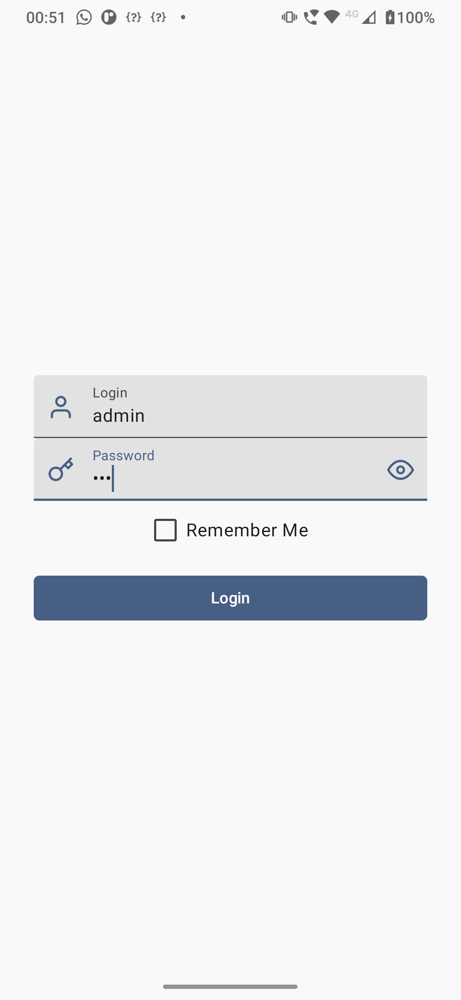
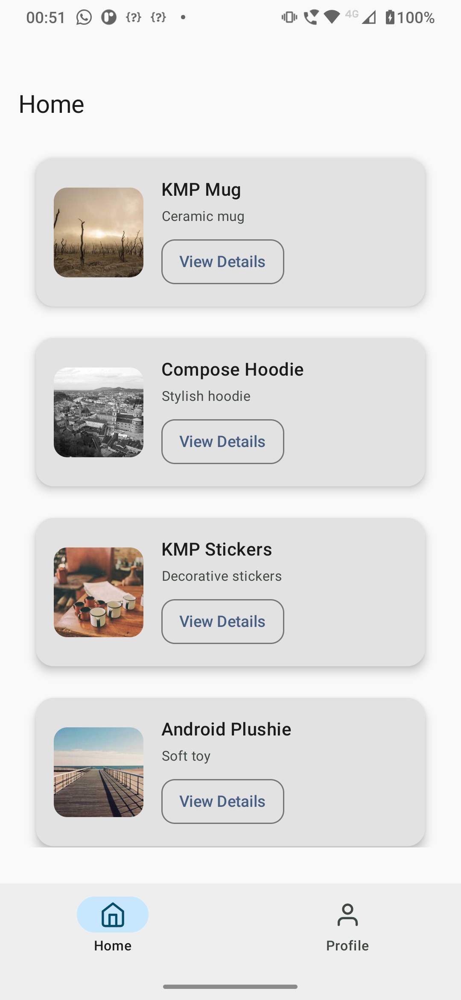
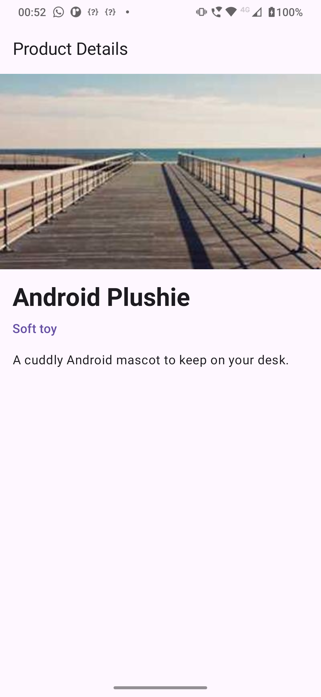
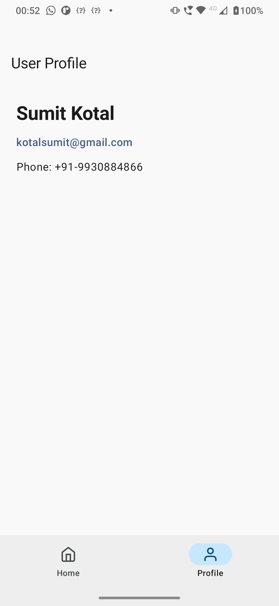
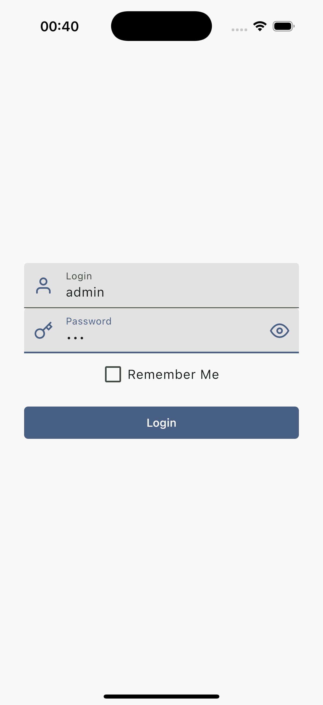
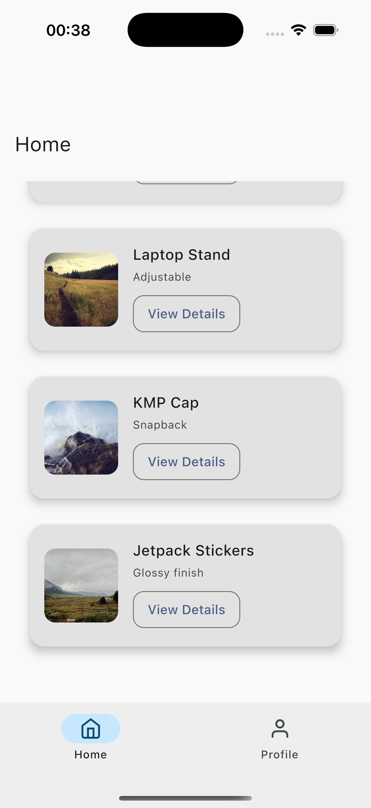
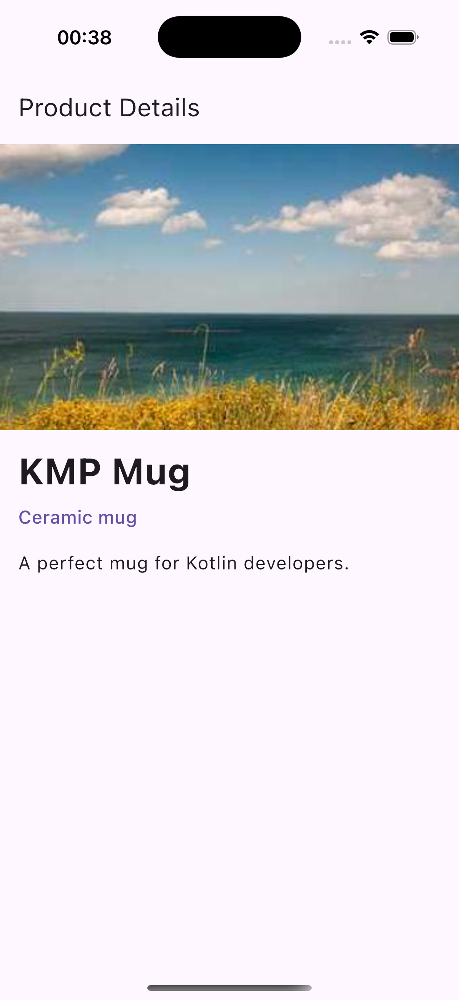
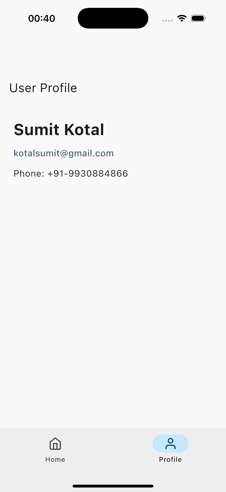

# Compose Multiplatform Demo App

This is a Compose Multiplatform app demonstrating a product catalog with login and profile functionality. It uses a mock API served locally via [Mountebank](https://github.com/bbyars/mountebank) and is built following modern Android and multiplatform practices.

---

## Tech Stack

- **Compose Multiplatform** – Shared UI for Android and iOS
- **Voyager** – Navigation
- **Ktor Client** – Networking
- **Koin** – Dependency Injection
- **Coil v3** – Image loading
- **Mountebank** – Local mock API
- **Multiplatform Settings** – Lightweight key-value caching

---

## Project Features

- Login screen with validation
- Home screen with product listing
- Profile screen with user data
- Bottom navigation
- Offline-ready with mock API
- Smooth image loading with placeholder and error handling
- Caching using [Multiplatform Settings](https://github.com/russhwolf/multiplatform-settings)

---

## Requirements

- **Java 17+**
- **Android Studio Bumblebee or newer**
- **Node.js v16** (via `nvm`)
- **npm v8.4.1**
- **Xcode (for iOS build)**
- **Mountebank** (installed globally)

---

## Setup Guide

### 1. Install Node.js and Mountebank

Open terminal and run:

```bash
curl -o- https://raw.githubusercontent.com/nvm-sh/nvm/v0.39.1/install.sh | bash
source ~/.nvm/nvm.sh
nvm install 16
nvm use 16
npm install -g npm@8.4.1
npm install -g mountebank
npm audit fix
```

---

### 2. Start Mountebank Server

From the project root:

```bash
mb --configfile imposters.ejs --ip 0.0.0.0
```

- Admin UI: `http://localhost:2525`
- Mock API: `http://localhost:2727`

---

### 3. Configure API Base URL in App

#### a. Emulator

```kotlin
val BASE_URL = "http://10.0.2.2:2727"
```

#### b. Physical Device

1. Ensure laptop and device are on the same Wi-Fi.
2. Find your laptop’s IP address:
    - macOS/Linux: `ifconfig | grep inet`
    - Windows: `ipconfig`
3. Update base URL:

```kotlin
val BASE_URL = "http://<YOUR_LAPTOP_IP>:2727"
```

> Make sure firewall allows incoming traffic on port `2727`.

---

### 4. Build & Run the App

#### Android

1. Open the project in Android Studio.
2. Select an Android device or emulator.
3. Click Run.

#### iOS

1. Open the `iosApp` module in Xcode.
2. Ensure a simulator or device is connected.
3. Click the Run button in Xcode.

> You can also use `./gradlew iosX64RunDebugExecutable` for CLI.

---

## Caching Mechanism

This project uses [Multiplatform Settings](https://github.com/russhwolf/multiplatform-settings) to cache basic user/session data across platforms. It's a lightweight key-value store available in both Android and iOS, similar to SharedPreferences or NSUserDefaults.

Usage:

```kotlin
val settings = Settings()
settings.putString("user_token", "abc123")
val token = settings.getStringOrNull("user_token")
```

This ensures fast access to frequently used data without repeated network calls.

---

## Screenshots

### Android
<p float="left">
  
  
  
  
</p>

### iOS
<p float="left">
  
  
  
  
</p>

---

## Project Structure

- `presentation/` – UI screens (Home, Profile, Login)
- `domain/` – Data models
- `data/` – Ktor client setup and API implementation
- `di/` – Koin modules
- `imposters.ejs` – Mountebank configuration

---

## Troubleshooting

| Issue                       | Fix                                                                  |
|-----------------------------|----------------------------------------------------------------------|
| Cannot connect to API       | Ensure correct base URL and Mountebank is running                    |
| Physical device not working | Verify IP, firewall, and network are properly set                    |
| Images not loading          | Ensure URLs are public and Coil is configured with placeholder/error |

---

## Support

**Sumit Kotal**  
kotalsumit@gmail.com  
+91 9930884866